# test-devops
## Introduction

This is a technical test for the role of **DevOps Engineer**.

## Objectives

This test helps us to understand
- how do you approach infrastructure design
- how do you manage microservices communication
- how do you consider security implications

## Project Setup

Project root has [`index.js`](/index.js) file. It simulates a simple app that runs infinitely & sends metrics to a [`statsd`](https://github.com/statsd/statsd) server.

## Exercices

  1. Add a `Dockerfile` to containerize the app, with support for multiple environments (test, development & production)
  2. Add a `docker-compose.yml` file to setup Node app, `statsd` & the backend. Applicants can use any backends for `statsd` (eg: `Graphite`).
  3. Use any IAC tools (Cloudformation, Terraform etc.) to prepare the infrastructure
  4. (Optional) Deploy on any cloud computing platforms

## Submitting Your Code

Email us your Github repo. We expect meaningful git commits, ideally one commit per exercise with commit messages clearly communicating the intent.

In case you deploy it to any cloud platforms, please send us instructions & relevant IAM user credentials.


# Answer
## 1. Solution Architecture

1. Github  Github action (CI)
- Source code management
- CI pipeline build, test, lint, security scan (SAST), build container image

2. ArgoCD (Akuity) — GitOps CD 
- Watch Git repo → auto-sync manifests
- Deploy to GKE/EKS multi-cloud
- Manage progressive rollout (Blue/Green, Canary)

3. Artifact Registry (GCP)
- Centralized Docker Image Storage
- Multi-cloud consumption (GKE + EKS)

4. HashiCorp Vault (HCP Vault — SaaS)
- JWT/OIDC auth (GitHub Actions, Kubernetes Service Account)
- Secrets management (DB credentials, API keys)
- Dynamic secrets (optional)

5. GKE + EKS (NON PROD + PROD)
- Workload clusters multi-cloud
- Each cluster installs:
- ArgoCD agent
- Vault Agent Injector (Sidecar)
- Datadog Agent (Daemon set)

6. Cloudflare Global Load Balancer + WAF
- Anycast Load Balancer (Global)
- Route to GKE/EKS multi-cloud cluster
- Zero Trust (WAF, Bot Protection, Firewall Rules)

7. Datadog Agents
- Logging (stdout)
- Metrics (autodiscovery)
- APM/Tracing
- RUM optional

Architecture Diagram:


## 2. Application Architecture

```mermaid
flowchart LR
    subgraph Kubernetes Node
        subgraph PodA["App Pod"]
            App["🟢 Application (Node.js, Go, Java, etc.)"]
        end

        subgraph PodB["Datadog Agent Pod (DaemonSet)"]
            Agent["🐶 Datadog Agent"]
            DogStatsD["📊 DogStatsD UDP Port 8125"]
            LogCollector["📜 Log Collector (Tail Files/Container Logs)"]
        end
    end

    App -- " StatsD Metrics (UDP 8125) " --> DogStatsD
    App -- " HTTP/GRPC Custom Metrics " --> Agent
    App -- " Container Log STDOUT " --> LogCollector
    Agent -- " Send To Datadog Cloud " --> DD["☁️ Datadog Cloud"]

```



### Components

- **Application Pod**: รันแอปพลิเคชันของคุณ (เช่น Node.js, Go, Java)
- **Datadog Agent Pod**: รัน Datadog Agent ในรูปแบบ DaemonSet เพื่อเก็บ Metrics และ Logs จาก Application Pod
    - **DogStatsD**: รับ Metrics ผ่าน UDP port 8125
    - **Log Collector**: รวบรวม Logs จาก STDOUT ของ Container
- **Datadog Cloud**: บริการคลาวด์ของ Datadog ที่เก็บและแสดงผล Metrics และ Logs

### Data Flow

1. แอปพลิเคชันส่ง Metrics ไปยัง Datadog Agent ผ่าน DogStatsD
2. Datadog Agent รวบรวม Metrics และ Logs แล้วส่งไปยัง Datadog Cloud เพื่อการวิเคราะห์และแสดงผล
3. คุณสามารถดู Metrics และ Logs ผ่าน Datadog Dashboard ได้ทันที

### Benefits

- **Centralized Monitoring**: รวบรวม Metrics และ Logs จากหลายแอปพลิเคชันในที่เดียว
- **Scalability**: Datadog Agent รันในรูปแบบ DaemonSet ทำให้สามารถขยายตัวได้ตามจำนวน Node ในคลัสเตอร์
- **Flexibility**: รองรับหลายภาษาและแพลตฟอร์มของแอปพลิเคชัน
- **Real-time Insights**: ดูข้อมูลแบบเรียลไทม์เพื่อการวิเคราะห์ประสิทธิภาพและการแก้ไขปัญหา

## Test concepts on docker desktop kubernetes cluster with local image registry

Helm chart for deploying Datadog Agent alongside your application for monitoring and logging.

### Prerequisites

- Docker Desktop with Kubernetes enabled
- kubectl configured
- helm 3.x installed

### Quick Start

#### 1. Build & Deploy

**Build Image**

```bash
# จาก root ของ project
docker build -t test-devops:latest .
```

**Without Datadog (Local Testing):**

```bash
# จาก root ของ project
helm install test-devops ./helm/test-devops \
  --namespace test-devops \
  --create-namespace \
  --wait
```

**With Datadog:**

```bash
# Build Docker image
# Deploy with Helm + Datadog
helm upgrade --install test-devops ./helm/test-devops \
  --namespace test-devops \
  --create-namespace \
  --set datadog.apiKey=<YOUR_DATADOG_API_KEY> \
  --wait
```

## 3. Data Architect
This architecture shows how the system collects and sends metrics, logs, traces, and system resource data from the application and database to Datadog for monitoring and analysis.

1. User Layer
- End users send requests to the application, generating traffic that produces logs, metrics, and traces.

2. Workload Layer
- Application (Node.js) handles user requests.
- Database processes queries and generates query-related telemetry.

3. Telemetry Export Layer
- Metrics exported via StatsD.
- Traces collected using OpenTelemetry.
- Logs forwarded through STDOUT.
- Database telemetry includes slow-query logs and database traces.

4. System Resource Collection
- Collects container and node-level resource usage (CPU, memory, disk, IO).
- Database resource usage is also monitored separately.

5. Datadog Agent Layer
- Datadog Agent receives metrics, logs, traces, and system metrics.
- Performs processing and securely forwards data to Datadog.

6. Datadog Platform
- Provides dashboards, log analysis, APM tracing, system monitoring, and alerting.
- Enables performance insights, troubleshooting, and SLO-based alerting.

```mermaid
flowchart LR

%% ========= USER ==========
subgraph L0[🟨 User Layer]
    U1[End User / Client]
end

%% ========= WORKLOAD ==========
subgraph L1["WORKLOAD"]
    A1[Node.js Application]
    DB1[(Database
PostgreSQL/MySQL/MongoDB)]

    %% ========= TELEMETRY ==========
    subgraph L2[🟩 Telemetry Export Layer]
        E1["📊 Metrics Export (StatsD)"]
        E2["🧠 Trace Export (OpenTelemetry)"]
        E3["📄 Log Forward (STDOUT)"]
        E4["🗃 DB Slow Query Log & Trace"]
    end

    %% ========= SYSTEM ==========
    subgraph L3[🟫 System Resource Collector Layer]
        S1[📌 Container CPU/Memory Collector]
        S2[📌 Node Metrics / cAdvisor / Kubelet]
        S3[📌 DB Resource Usage Collector]
    end
end



%% ========= COLLECTION ==========
subgraph L4[🟧 Datadog Agent Collection Layer]
    D1["🐶 DogStatsD Metrics"]
    D2["💠 APM Trace Collector"]
    D3["📄 Log Processor"]
    D4["🔐 Secure Aggregator (HTTPS + API Key)"]
end

%% ========= ANALYTICS ==========
subgraph L5[🟥 Datadog Analytics & Alert Layer]
    DD1[📊 Metrics Dashboard]
    DD2[📌 Log Explorer]
    DD3["🧠 Trace Explorer (App + DB)"]
    DD4[🧮 System & DB Performance]
    DD5[🔔 Alert & SLO Monitoring]
end

%% ==== FLOWS =====
U1 -->|Request| A1
A1 -->|Queries| DB1

A1 -->|Runtime Metrics| E1 --> D1
A1 -->|Trace Spans| E2 --> D2
A1 -->|Logs| E3 --> D3

DB1 -->|Slow Query Logs| E4 --> D3
DB1 -->|DB Query Tracing| E4 --> D2

S1 --> D1
S2 --> D1
S3 --> D1

D1 --> D4 --> DD1
D2 --> D4 --> DD3
D3 --> D4 --> DD2
D1 --> D4 --> DD4
DD1 --> DD5
DD2 --> DD5
DD3 --> DD5
DD4 --> DD5
```



## 4. Deployment Pipeline (Enterprise DevOps Standard)

A modern deployment pipeline ensures consistent, secure, and reliable delivery of applications across multiple
environments. This document describes the architecture, components, flows, and best practices for implementing an
enterprise-grade CI/CD pipeline.

### Core Components

| Component                  | Purpose                                          | Platform/Tool         |
|----------------------------|--------------------------------------------------|-----------------------|
| SCM                        | Source versioning, branch policies, PR workflows | GitHub                |
| CI                         | Build, test, code scan, image creation           | GitHub Actions        |
| CD (GitOps)                | Automated deployment via Kubernetes manifests    | ArgoCD (Akuity)       |
| Container Registry         | Image storage, multi-cloud distribution          | GCP Artifact Registry |
| Secrets Management         | Centralized secure secrets & dynamic credentials | HCP Vault             |
| Runtime Platforms          | Multi-cloud Kubernetes workloads                 | GKE (GCP), EKS (AWS)  |
| Global Security & Routing  | WAF, DNS, global load balancing                  | Cloudflare            |
| Monitoring & Observability | Metrics, logging, APM tracing                    | Datadog               |

### CI Best Practices

1. Develop features in separate branches and submit Pull Requests.
2. Automate linting, unit tests, and code quality checks.
3. Gate merges using SonarQube Quality Gate results.
4. Enforce branch protection and mandatory reviewer approvals.
5. Use semantic tags (e.g., v1.2.0) for production-ready builds.

### CD Best Practices (GitOps)

1. Store Kubernetes manifests under version control.
2. Deploy changes only via Git (no kubectl/manual actions).
3. Use controlled rollout strategies:
    - Blue/Green
    - Canary
4. Maintain separate overlays for each environment (DEV/UAT/PROD).
5. Monitor deployment metrics and rollback automatically when required.

### Security Guidelines

1. Manage secrets exclusively through HCP Vault—never commit secrets.
2. Enforce RBAC on clusters, CI/CD pipelines, and artifact access.
3. Sign all images (Cosign) and generate SBOM (Syft).
4. Scan application and image vulnerabilities (SonarQube & Trivy).
5. Audit IAM roles regularly and enforce least-privilege access.

### Monitoring & Logging

1. Use Datadog dashboards to visualize metrics, logs, and infrastructure health.
2. Enable APM and distributed tracing for service observability.
3. Set alerts on key events:
    - Deployment health
    - Latency thresholds
    - Error rate anomalies
4. Review logs to continuously improve performance and user experience.

### Conclusion

A robust CI/CD pipeline is essential for modern enterprise delivery.
By following the practices outlined above, organizations can ensure ***secure***, ***reliable***,
and ***highly automated deployments*** across multi-cloud environments with full observability and governance.

### Pipeline Overview

#### Overall Pipeline Diagram


#### Flow 1: Pull Request Validation (CI Only)

```mermaid
flowchart LR
    A1[Developer Creates PR \nto develop/main] --> A2[Checkout Source]
    A2 --> A3[Run Lint]
    A3 --> A4[Run Unit Tests]
    A4 --> A5[SonarQube Code Scan]
    A5 --> A6{Quality Gate Passed?}
    A6 -->|No| A7["Block Merge ❌"]
    A6 -->|Yes| A8[Approve & Merge]

```



Goal: Verify code quality before allowing merge to main branches.

How It Works:

| Step | Action                                                  | Purpose                                           |
|------|---------------------------------------------------------|---------------------------------------------------|
| 1    | Developer creates a Pull Request to `develop` or `main` | Prepare code for review and validation            |
| 2    | CI system checks out the source code                    | Load the code that needs validation               |
| 3    | Run `Lint`                                              | Ensure code formatting and standards              |
| 4    | Run `Unit Tests`                                        | Validate business logic and functionality         |
| 5    | Perform `SonarQube Code Scan`                           | Identify bugs, vulnerabilities, and code smells   |
| 6    | Evaluate `Quality Gate` result                          | Determine whether the code is acceptable          |
| 7    | If it fails → **Block Merge ❌**                         | Prevent bad code from entering main branches      |
| 8    | If it passes → **Approve & Merge ✔️**                   | Code is allowed into the repository’s main branch |

Outcome

- Only high-quality, tested, and secure code can be merged.
- Reduces production bugs and future rework.

#### Flow 2: Auto CI/CD (develop → DEV, main → UAT)

```mermaid
flowchart LR
    B1[Push to develop/main] --> B2[Checkout Source]
    B2 --> B3[Lint]
    B3 --> B4[Unit Test]
    B4 --> B5[Sonar Scan + Quality Gate]
    B5 --> B6{Passed?}
    B6 -->|No| B7["Stop Pipeline ❌"]
    B6 -->|Yes| B8[Build Docker Image]
    B8 --> B9["Generate SBOM (Syft)"]
    B9 --> B10["Sign Image (Cosign)"]
    B10 --> B11["Security Scan (Trivy)"]
    B11 --> B12{Target Branch?}
    B12 -->|develop| B13[Update k8s Overlay: DEV]
    B12 -->|main| B14[Update k8s Overlay: UAT]
    B13 --> C1[ArgoCD Deploy to DEV]
    B14 --> C2[ArgoCD Deploy to UAT]

```



Goal: Automatically Test + Build + Sign + Scan + Deploy for Non-Production Environments.

How It Works

| Step | Action                                   | Purpose                                              |
|------|------------------------------------------|------------------------------------------------------|
| 1    | Push commits to `develop` or `main`      | Trigger automated CI/CD                              |
| 2    | Run Lint, Unit Tests, and SonarQube scan | Double validation before deployment                  |
| 3    | If scan fails → ***Stop pipeline ❌***    | Prevent deployment of insecure code                  |
| 4    | If passed → Build Docker Image           | Prepare deployable application artifact              |
| 5    | Generate SBOM (via Syft)                 | Document software components for security compliance |
| 6    | Sign Image using Cosign                  | Ensure image authenticity                            |
| 7    | Scan Image using Trivy                   | Detect vulnerabilities in the container              |
| 8    | Update correct Kubernetes overlay        | Update image tag based on branch                     |
| 9    | ArgoCD detects change and Syncs          | Deploy automatically to respective cluster           |

Branch Deployment Mapping

| Branch    | Environment | Kubernetes Overlay |
|-----------|-------------|--------------------|
| `develop` | DEV         | `k8s/overlays/dev` |
| `main`    | UAT         | `k8s/overlays/uat` |

Outcome

- Every valid commit is automatically deployed to the intended environment.
- No manual kubectl usage → secure and traceable deployment.

#### Flow 3: Release Tag — CI Only


How It Works

| Step | Action                                          | Purpose                                |
|------|-------------------------------------------------|----------------------------------------|
| 1    | Developer creates a version tag, e.g., `v1.0.0` | Marks release for production           |
| 2    | CI pipeline builds Docker Image                 | Create version-specific artifact       |
| 3    | Generate SBOM + Sign + Scan                     | Ensure full security compliance        |
| 4    | Publish the artifact                            | Image becomes available for deployment |
| 5    | No deployment occurs                            | Await manual approval and release      |

Outcome

- You get an official, secure, versioned production build.
- Deployment is controlled for risk-sensitive environments.

#### Flow 4: Manual Deployment (GitOps)


Goal: Deploy selected versions using Git workflows with approval controls.

How It Works

| Step | Action                                      | Purpose                                   |
|------|---------------------------------------------|-------------------------------------------|
| 1    | Select image tag and target environment     | Decide what to deploy and where           |
| 2    | Deployment must be approved                 | Enforces controlled, auditable deployment |
| 3    | Update Kubernetes overlay with selected tag | Link the chosen release version           |
| 4    | Commit & Push the change                    | Version-controlled deployment             |
| 5    | ArgoCD detects manifest change and Syncs    | Deploys changes to the cluster            |
| 6    | Monitor deployment via ArgoCD + Datadog     | Track performance and health              |

Outcome

- Fully auditable deployment history via Git.
- Zero cluster access — no direct deployment by engineers.
- Production rollouts are secure, controlled, and traceable.

#### Summary Comparison

| Flow              | Trigger               | Purpose                          | Deployment           |
|-------------------|-----------------------|----------------------------------|----------------------|
| **PR Validation** | Pull Request          | Verify quality                   | ❌ No                 |
| **Auto CI/CD**    | Push to develop/main  | Auto build + deploy non-prod     | ✔️ Automatic         |
| **Release Tag**   | Push tag              | Create production build          | ❌ No                 |
| **Manual Deploy** | Approval + Git change | Controlled production deployment | ✔️ Manual via GitOps |


## 5. Implementation Plan

### Architecture Components

1. GitHub + GitHub Actions (CI)
2. GCP Artifact Registry
3. ArgoCD + Akuity (GitOps Deployment)
4. HCP Vault (Centralized Secrets Management)
5. Multi-Cloud Kubernetes Clusters
   - Google GKE (NON-PROD, PROD)
   - AWS EKS (NON-PROD, PROD)
6. Cloudflare (Global Load Balancer + WAF Security Layer)
7. Datadog (Monitoring, Logging, and APM)

#### day 1. GitHub + GitHub Actions (Continuous Integration)
1. Create and manage application repositories in GitHub.
2. Configure CI pipelines using GitHub Actions.
3. Integrate CI pipelines with GCP Artifact Registry for container image publishing.
4. Enable automated linting, unit tests, and code quality scanning.
5. Enforce branch protection policies and mandatory code review approval.
6. Document CI standards, workflows, and developer guidelines.

#### day 2. GCP Artifact Registry
1. Provision a GCP project dedicated to Artifact Registry usage.
2. Enable required GCP APIs (Artifact Registry, IAM, etc.).
3. Create repositories for hosting Docker images.
4. Configure IAM roles and access controls for secure image management.
5. Connect GitHub Actions to Artifact Registry for automated image pushes.
6. Provide documentation outlining image management and repository usage policies.

#### day 3. ArgoCD + Codefresh (GitOps Deployment)
1. Deploy ArgoCD in a dedicated Kubernetes cluster for centralized control.
2. Configure Codefresh to integrate with GitOps workflows.
3. Define ArgoCD applications responsible for cluster deployments.
4. Establish GitHub integration for automatic deployment on manifest updates.
5. Set up monitoring and alerting for deployment failures or drift detection.
6. Document GitOps standards, workflow diagrams, and ArgoCD operation guidelines.


#### day 4. HCP Vault (Secrets Management)
1. Deploy HCP Vault to manage application and infrastructure secrets.
2. Configure authentication methods (Kubernetes auth, OIDC, etc.).
3. Provision secret engines and policy access rules.
4. Integrate Vault with Kubernetes via Vault Agent Injector or CSI provider.
5. Enable auditing, logging, and usage monitoring for security compliance.
6. Produce documentation for secret lifecycle management and access procedures.

#### day 5. Multi-Cloud Kubernetes Platform
   GKE (Google Kubernetes Engine)
1. Provision GKE clusters for NON-PROD and PROD environments.
2. Configure network policies, RBAC, and secure cluster access.
3. Deploy ArgoCD agents in each cluster for GitOps deployment execution.
4. Install Vault Agent Injector for secure secret synchronization.
5. Deploy Datadog agents for observability (logs, metrics, APM).
6. Document GKE operational practices and disaster recovery procedures.

    EKS (Amazon Elastic Kubernetes Service)
1. Provision EKS clusters for NON-PROD and PROD environments.
2. Configure VPC networking, security groups, and RBAC access controls.
3. Deploy ArgoCD agents for cluster deployment management.
4. Integrate Vault Agent Injector for secret delivery.
5. Deploy Datadog agents for metrics, logs, and distributed tracing.
6. Document EKS administrative operations and cluster maintenance procedures.

#### day 6. Cloudflare (Global Load Balancer + WAF)
1. Configure Cloudflare account and domain onboarding.
2. Deploy Global Load Balancer routing traffic to GKE/EKS clusters.
3. Implement WAF threat policies and rate-limiting protection.
4. Enable security monitoring, analytics, and alerting.
5. Document Cloudflare architecture, routing strategy, and operational processes.

#### day 7. Datadog (Monitoring, Logging, and APM)
1. Create and configure Datadog organization and integrations.
2. Deploy Kubernetes monitoring agents (logs, metrics, traces).
3. Build dashboards and alerts for application and infrastructure health.
4. Integrate GitHub Actions CI/CD telemetry to track pipeline performance.
5. Document monitoring standards, dashboards usage, and alert handling procedures.


## 6. HashiCorp Vault OSS - Complete Installation Guide

### 📚 Table of Contents

#### Part A: Deployment Options
1. [Overview](#overview)
2. [Architecture Comparison](#architecture-comparison)
3. [Prerequisites](#prerequisites)

#### Part B: Docker Deployment (Standalone/Development)
4. [Docker Installation](#docker-installation)
5. [Docker Configuration](#docker-configuration)
6. [Docker SSL/TLS Setup](#docker-ssltls-setup)

#### Part C: Kubernetes Deployment (Production/HA)
7. [Kubernetes Installation](#kubernetes-installation)
8. [Kubernetes Configuration](#kubernetes-configuration)
9. [Kubernetes SSL/TLS & Ingress](#kubernetes-ssltls--ingress)
10. [High Availability Setup](#high-availability-setup)

#### Part D: Common Configuration
11. [Kubernetes Integration](#kubernetes-integration)
12. [CSI Driver Setup](#csi-driver-setup)
13. [Security & Best Practices](#security--best-practices)
14. [Monitoring & Backup](#monitoring--backup)
15. [Troubleshooting](#troubleshooting)

---

### Overview

This comprehensive guide covers **two deployment methods** for HashiCorp Vault OSS (Open Source Software):

#### 🐳 Option 1: Docker Deployment
**Best for:**
- Development environments
- Testing and POC
- Single-server deployments
- Quick setup and prototyping

**Components:**
- Vault Server (Docker container)
- NGINX reverse proxy (SSL termination)
- File-based storage backend
- Single instance (non-HA)

#### ☸️ Option 2: Kubernetes Deployment
**Best for:**
- Production environments
- High Availability requirements
- Cloud-native architecture
- Scalable infrastructure

**Components:**
- Vault StatefulSet (3+ replicas)
- Integrated Raft storage
- Kubernetes Ingress (NGINX)
- Auto-unseal capabilities
- Production-grade HA

---

### Architecture Comparison

#### Docker Architecture
```
┌─────────────────────────────────────┐
│          Internet/Users             │
└──────────────┬──────────────────────┘
               │
        ┌──────▼───────┐
        │ NGINX (443)  │
        │ SSL Terminate│
        └──────┬───────┘
               │
        ┌──────▼───────┐
        │ Vault Server │
        │   (8200)     │
        └──────┬───────┘
               │
        ┌──────▼───────┐
        │ File Storage │
        │  (Volume)    │
        └──────────────┘
```

#### Kubernetes Architecture
```
┌──────────────────────────────────────────────┐
│          Internet/External Traffic           │
└──────────────────┬───────────────────────────┘
                   │
            ┌──────▼────────┐
            │ Load Balancer │
            └──────┬────────┘
                   │
            ┌──────▼────────┐
            │ Ingress (TLS) │
            └──────┬────────┘
                   │
   ┌───────────────┼───────────────┐
   │               │               │
┌──▼───┐      ┌────▼───┐      ┌───▼──┐
│Vault │◄─────►Vault  │◄─────►│Vault │
│Pod-0 │      │Pod-1  │       │Pod-2 │
│Active│      │Standby│       │Standby│
└──┬───┘      └───┬───┘       └───┬──┘
   │              │               │
   └──────────────┼───────────────┘
                  │
          ┌───────▼────────┐
          │  Raft Storage  │
          │ (StatefulSet)  │
          └────────────────┘
```

---

### Prerequisites

#### Common Requirements
- **Vault CLI**: HashiCorp Vault client
- **kubectl**: Kubernetes CLI (for both options)
- **Domain name**: For SSL certificate
- **SSL certificate**: Cloudflare Origin or Let's Encrypt

#### Docker-Specific Requirements
- **Linux server**: Ubuntu 20.04+ / CentOS 8+ / RHEL 8+
- **Docker Engine**: 20.10+
- **Docker Compose**: 2.0+
- **Resources**:
    - CPU: 2 cores minimum
    - Memory: 4GB minimum
    - Storage: 20GB minimum

#### Kubernetes-Specific Requirements
- **Kubernetes Cluster**: 1.24+
    - GKE, EKS, AKS, or on-premises
- **Helm**: 3.0+
- **Storage Class**: For PersistentVolumes
- **Ingress Controller**: NGINX Ingress
- **Resources**:
    - CPU: 3 cores minimum (1 core per pod)
    - Memory: 6GB minimum (2GB per pod)
    - Storage: 30GB minimum (10GB per pod)

#### Install Prerequisites

```bash
# Install Vault CLI
wget -O- https://apt.releases.hashicorp.com/gpg | sudo gpg --dearmor -o /usr/share/keyrings/hashicorp-archive-keyring.gpg
echo "deb [signed-by=/usr/share/keyrings/hashicorp-archive-keyring.gpg] https://apt.releases.hashicorp.com $(lsb_release -cs) main" | sudo tee /etc/apt/sources.list.d/hashicorp.list
sudo apt update && sudo apt install vault

# Install kubectl
curl -LO "https://dl.k8s.io/release/$(curl -L -s https://dl.k8s.io/release/stable.txt)/bin/linux/amd64/kubectl"
sudo install -o root -g root -m 0755 kubectl /usr/local/bin/kubectl

# Install Helm (for Kubernetes deployment)
curl https://raw.githubusercontent.com/helm/helm/main/scripts/get-helm-3 | bash

# Verify installations
vault version
kubectl version --client
helm version
```

---

## Part B: Docker Deployment

### Docker Installation

#### 1. Project Structure Setup

```bash
# Create directory structure
mkdir -p /opt/vault-nginx/{vault/{config,data,logs},nginx,certs}
cd /opt/vault-nginx

# Verify structure
tree -L 2 /opt/vault-nginx
```

#### 2. Docker Compose Configuration

Create `docker-compose.yml`:

#### 2. Docker Compose Configuration

Create `docker-compose.yml`:

```yaml
version: '3.8'

services:
  vault:
    image: hashicorp/vault:1.18.0
    container_name: vault
    restart: unless-stopped
    cap_add:
      - IPC_LOCK
    environment:
      VAULT_ADDR: http://0.0.0.0:8200
      VAULT_LOG_LEVEL: info
    volumes:
      - ./vault/config:/vault/config:ro
      - ./vault/data:/vault/data
      - ./vault/logs:/vault/logs
    ports:
      - "8200:8200"
    command: "vault server -config=/vault/config/config.hcl"
    networks:
      - vault-network
    healthcheck:
      test: ["CMD", "vault", "status"]
      interval: 10s
      timeout: 5s
      retries: 3

  nginx:
    image: nginx:stable-alpine
    container_name: vault-nginx
    restart: unless-stopped
    depends_on:
      vault:
        condition: service_healthy
    ports:
      - "80:80"
      - "443:443"
    volumes:
      - ./nginx/nginx.conf:/etc/nginx/conf.d/default.conf:ro
      - ./certs:/etc/nginx/ssl:ro
    networks:
      - vault-network
    healthcheck:
      test: ["CMD", "wget", "--quiet", "--tries=1", "--spider", "http://localhost/health"]
      interval: 30s
      timeout: 10s
      retries: 3

networks:
  vault-network:
    driver: bridge
```

#### 3. Start Docker Services

```bash
# Start services
docker-compose up -d

# Check services status
docker-compose ps

# View logs
docker-compose logs -f vault
docker-compose logs -f nginx
```

### Docker Configuration

#### 1. Vault Configuration File

Create `vault/config/config.hcl`:

```hcl
ui = true
disable_mlock = true

storage "file" {
  path = "/vault/data"
}

listener "tcp" {
  address     = "0.0.0.0:8200"
  tls_disable = "true"  # TLS terminated at NGINX
}

api_addr = "http://0.0.0.0:8200"
cluster_addr = "http://0.0.0.0:8201"

# Telemetry for monitoring
telemetry {
  disable_hostname = false
  prometheus_retention_time = "24h"
}
```

#### 2. Initialize Vault (First Time Only)

```bash
# Set Vault address
export VAULT_ADDR="https://vault-devops.extosoft.app"
export VAULT_SKIP_VERIFY=true  # Only if using self-signed cert

# Initialize Vault
vault operator init \
  -key-shares=5 \
  -key-threshold=3 \
  -format=json > vault-init-keys.json

# ⚠️ CRITICAL: Backup vault-init-keys.json securely!

# Extract keys
cat vault-init-keys.json | jq -r '.unseal_keys_b64[]' > unseal-keys.txt
cat vault-init-keys.json | jq -r '.root_token' > root-token.txt

# Unseal Vault
vault operator unseal $(sed -n '1p' unseal-keys.txt)
vault operator unseal $(sed -n '2p' unseal-keys.txt)
vault operator unseal $(sed -n '3p' unseal-keys.txt)

# Check status
vault status

# Login
vault login $(cat root-token.txt)
```

#### 3. Enable Required Engines

```bash
# Enable KV secrets engine v2
vault secrets enable -path=secret kv-v2

# Enable Kubernetes authentication
vault auth enable kubernetes

# List enabled secrets engines
vault secrets list

# List enabled auth methods
vault auth list
```

### Docker SSL/TLS Setup

#### 1. NGINX Configuration

Create `nginx/nginx.conf`:

```nginx
upstream vault {
    server vault:8200;
}

server {
    listen 80;
    server_name vault-devops.extosoft.app;
    return 301 https://$server_name$request_uri;
}

server {
    listen 443 ssl http2;
    server_name vault-devops.extosoft.app;

    # SSL Configuration
    ssl_certificate /etc/nginx/ssl/vault-devops.extosoft.app.pem;
    ssl_certificate_key /etc/nginx/ssl/vault-devops.extosoft.app.key;
    
    # SSL Security
    ssl_protocols TLSv1.2 TLSv1.3;
    ssl_ciphers ECDHE-RSA-AES256-GCM-SHA512:DHE-RSA-AES256-GCM-SHA512;
    ssl_prefer_server_ciphers off;
    ssl_session_cache shared:SSL:10m;
    ssl_session_timeout 10m;
    
    # Security Headers
    add_header Strict-Transport-Security "max-age=31536000; includeSubDomains" always;
    add_header X-Frame-Options DENY;
    add_header X-Content-Type-Options nosniff;

    location / {
        proxy_pass http://vault;
        proxy_set_header Host $host;
        proxy_set_header X-Real-IP $remote_addr;
        proxy_set_header X-Forwarded-For $proxy_add_x_forwarded_for;
        proxy_set_header X-Forwarded-Proto $scheme;
        proxy_read_timeout 90;
        proxy_redirect http://vault https://vault-devops.extosoft.app;
    }
}
```

#### 2. SSL Certificate Setup

##### Using Cloudflare Origin Certificates:

1. Generate certificate in Cloudflare dashboard
2. Save certificate as `certs/vault-devops.extosoft.app.pem`
3. Save private key as `certs/vault-devops.extosoft.app.key`

```bash
# Set appropriate permissions
chmod 600 certs/vault-devops.extosoft.app.key
chmod 644 certs/vault-devops.extosoft.app.pem
```

### Kubernetes Integration

#### 1. Configure Kubernetes Authentication

Create GKE-specific auth configuration script:

```bash
#!/bin/bash
export VAULT_ADDR="https://vault-devops.extosoft.app"
export VAULT_TOKEN="your-vault-token"

# Get GKE cluster information
PROJECT_ID="$(gcloud config get-value project)"
ZONE="$(gcloud config get-value compute/zone)"
CLUSTER_NAME="$(kubectl config current-context | cut -d_ -f3)"
KUBERNETES_NAME="$(kubectl config current-context)"
KUBERNETES_HOST="$(kubectl cluster-info | grep "Kubernetes control plane" | awk '{print $7}')"
KUBERNETES_CA_CERT=$(kubectl config view --raw -o json | \
    jq -r '.clusters[] | select(.name=="'"$KUBERNETES_NAME"'") | .cluster."certificate-authority-data"' | \
    base64 -d)

echo "Project ID: $PROJECT_ID"
echo "Zone: $ZONE"
echo "Cluster Name: $CLUSTER_NAME"
echo "Using Kubernetes context: $KUBERNETES_NAME"
echo "KUBERNETES_HOST: $KUBERNETES_HOST"
echo "KUBERNETES_CA_CERT: $KUBERNETES_CA_CERT"

# Create long-lived service account token for token reviewer
TOKEN_REVIEWER_JWT=$(kubectl create token vault-auth -n vault --duration=87600h)

# Configure Vault Kubernetes auth
vault write auth/kubernetes/config \
    kubernetes_host="$KUBERNETES_HOST" \
    kubernetes_ca_cert="$KUBERNETES_CA_CERT" \
    issuer="https://container.googleapis.com/v1/projects/YOUR_PROJECT/locations/YOUR_ZONE/clusters/YOUR_CLUSTER" \
    token_reviewer_jwt="$TOKEN_REVIEWER_JWT" \
    disable_iss_validation=false
```

#### 2. Create Kubernetes Role and Policy

```bash
# Create policy for Kubernetes access
vault policy write k8s-policy - <<EOF
path "secret/data/datadog/*" {
  capabilities = ["read"]
}
path "secret/data/app/*" {
  capabilities = ["read"]
}
EOF

# Create Kubernetes role
vault write auth/kubernetes/role/k8s-app \
    bound_service_account_names=vault-csi-sa \
    bound_service_account_namespaces=your-namespace \
    policies=k8s-policy \
    ttl=24h
```

#### 3. Create Service Account and RBAC

```yaml
apiVersion: v1
kind: ServiceAccount
metadata:
  name: vault-auth
  namespace: vault
---
apiVersion: rbac.authorization.k8s.io/v1
kind: ClusterRole
metadata:
  name: vault-csi-role
rules:
- apiGroups: [""]
  resources: ["serviceaccounts/token"]
  verbs: ["create"]
---
apiVersion: rbac.authorization.k8s.io/v1
kind: ClusterRoleBinding
metadata:
  name: vault-csi-binding
roleRef:
  apiGroup: rbac.authorization.k8s.io
  kind: ClusterRole
  name: vault-csi-role
subjects:
- kind: ServiceAccount
  name: vault-csi-sa
  namespace: your-namespace
```

### CSI Driver Setup

#### 1. Install Secrets Store CSI Driver

```bash
# Add Helm repository
helm repo add secrets-store-csi-driver https://kubernetes-sigs.github.io/secrets-store-csi-driver/charts
helm repo update

# Install CSI Driver
helm install csi-secrets-store secrets-store-csi-driver/secrets-store-csi-driver \
    --namespace kube-system \
    --set syncSecret.enabled=true \
    --set enableSecretRotation=true
```

#### 2. Install Vault CSI Provider

```bash
# Install Vault CSI Provider
helm repo add hashicorp https://helm.releases.hashicorp.com
helm repo update

helm install vault-csi-provider hashicorp/vault-csi-provider \
    --namespace csi \
    --create-namespace
```

#### 3. Create SecretProviderClass

```yaml
apiVersion: secrets-store.csi.x-k8s.io/v1
kind: SecretProviderClass
metadata:
  name: vault-secrets
  namespace: your-namespace
spec:
  provider: vault
  parameters:
    vaultAddress: "https://vault-devops.extosoft.app"
    roleName: "k8s-app"
    objects: |
      - objectName: "datadog-api-key"
        secretPath: "secret/data/datadog/api"
        secretKey: "api_key"
      - objectName: "datadog-app-key"
        secretPath: "secret/data/datadog/api"
        secretKey: "app_key"
  secretObjects:
  - secretName: datadog-secret
    type: Opaque
    data:
    - objectName: datadog-api-key
      key: api-key
    - objectName: datadog-app-key
      key: app-key
```

#### 4. Use in Deployment

```yaml
apiVersion: apps/v1
kind: Deployment
metadata:
  name: your-app
spec:
  template:
    spec:
      serviceAccountName: vault-csi-sa
      containers:
      - name: app
        image: your-app:latest
        volumeMounts:
        - name: vault-secrets
          mountPath: "/mnt/secrets"
          readOnly: true
      volumes:
      - name: vault-secrets
        csi:
          driver: secrets-store.csi.k8s.io
          readOnly: true
          volumeAttributes:
            secretProviderClass: "vault-secrets"
```

### Sample Secret Management

#### 1. Store Secrets in Vault

```bash
# Store Datadog API credentials
vault kv put secret/datadog/api \
    api_key="your-datadog-api-key" \
    app_key="your-datadog-app-key"

# Store database credentials
vault kv put secret/app/database \
    username="dbuser" \
    password="supersecret123"

# Store application configuration
vault kv put secret/app/config \
    environment="production" \
    debug="false" \
    max_connections="100"
```

#### 2. Read Secrets (Testing)

```bash
# Read secrets
vault kv get secret/datadog/api
vault kv get secret/app/database
vault kv get secret/app/config

# Get specific field
vault kv get -field=api_key secret/datadog/api
```

### Security Best Practices

#### 1. Vault Security
- Use strong unsealing keys and store them securely
- Rotate root token regularly
- Implement least-privilege access policies
- Enable audit logging
- Regular backups of Vault data

#### 2. Network Security
- Use TLS everywhere (Vault to NGINX, NGINX to clients)
- Implement firewall rules
- Use private networks for backend communication
- Regular SSL certificate rotation

#### 3. Kubernetes Security
- Use dedicated service accounts for each application
- Implement RBAC properly
- Rotate service account tokens
- Monitor and audit access

### Monitoring and Maintenance

#### 1. Health Checks

```bash
# Check Vault status
vault status

# Check seal status
vault operator key-status

# Check authentication methods
vault auth list

# Check secrets engines
vault secrets list
```

#### 2. Backup Procedures

```bash
# Backup Vault data
docker exec vault-container tar czf /tmp/vault-backup.tar.gz /vault/data

# Copy backup from container
docker cp vault-container:/tmp/vault-backup.tar.gz ./vault-backup-$(date +%Y%m%d).tar.gz
```

#### 3. Log Management

```bash
# Check Vault logs
docker logs vault

# Check NGINX logs
docker logs vault-nginx

# Monitor CSI driver logs
kubectl logs -n kube-system daemonset/secrets-store-csi-driver
kubectl logs -n csi deployment/vault-csi-provider
```

### Troubleshooting

#### Common Issues and Solutions

##### 1. Vault Initialization Issues
```bash
# Check if Vault is sealed
vault status

# Unseal if needed
vault operator unseal
```

##### 2. SSL Certificate Problems
```bash
# Test SSL configuration
openssl s_client -connect vault-devops.extosoft.app:443

# Check certificate validity
openssl x509 -in certs/vault-devops.extosoft.app.pem -text -noout
```

##### 3. Kubernetes Authentication Failures
```bash
# Check service account token
kubectl create token vault-csi-sa -n your-namespace

# Test Vault authentication manually
vault write auth/kubernetes/login role=k8s-app jwt="$(kubectl create token vault-csi-sa -n your-namespace)"
```

##### 4. CSI Mount Issues
```bash
# Check CSI driver status
kubectl get pods -n kube-system | grep secrets-store
kubectl get pods -n csi | grep vault-csi

# Check SecretProviderClass
kubectl get secretproviderclass -n your-namespace

# Check pod events
kubectl describe pod your-pod-name
```

#### Useful Commands

```bash
# Restart Vault services
docker-compose restart

# View all containers
docker-compose ps

# Follow logs
docker-compose logs -f vault
docker-compose logs -f nginx

# Kubernetes debugging
kubectl get events --sort-by=.metadata.creationTimestamp
kubectl logs deployment/your-app
```

### Conclusion

This guide provides a complete setup for HashiCorp Vault OSS with Kubernetes integration. Follow the security best practices and monitoring procedures to maintain a secure and reliable secret management system.

For additional information, refer to:
- [HashiCorp Vault Documentation](https://www.vaultproject.io/docs)
- [Kubernetes Secrets Store CSI Driver](https://secrets-store-csi-driver.sigs.k8s.io/)
- [Vault CSI Provider](https://github.com/hashicorp/vault-csi-provider)


## 7. DevSecOps Command Center

### Application endpoint 
#### dev environment


#### uat environment


### Application metrics (statd)
#### dev environment


#### uat environment


### Resource monitoring 
#### non-prod environment


#### prod environment


## 8. Future improvements

### EKS (Amazon Elastic Kubernetes Service)
#### Objective : Multi-Cloud.
#### Estimate plan : 10-15 days (Complexity :high)
1. Provision EKS clusters for NON-PROD and PROD environments.
2. Configure VPC networking, security groups, and RBAC access controls.
3. Deploy ArgoCD agents for cluster deployment management.
4. Integrate Vault Agent Injector for secret delivery.
5. Deploy Datadog agents for metrics, logs, and distributed tracing.
6. Document EKS administrative operations and cluster maintenance procedures.

### Improve Security
#### Objective : End-to-End Supply Chain Security & Compliance.
#### Estimate plan : 15-20 days (Complexity :very high)
1. Adopt SLSA for supply chain security
2. Enable Cosign image signing with Sigstore
3. Compliance alignment (ISO27001, NIST SSDF, OWASP SAMM)
4. AI-based anomaly detection for security operations

### Kubenetes Vault cluster
#### Objective : Centralized, High-Available Secret Management & Zero Trust Identity.
#### Estimate plan : 8-12 days (Complexity :medium-high)
1. Design HA with Raft: Deploy HA cluster using Raft storage to simplify architecture.
2. AWS KMS Auto-Unseal: Configure auto-unseal via AWS KMS for operational resilience.
3. Secure Deployment: Enforce end-to-end TLS and strict Network Policies via Helm.
4. K8s Auth Integration: Enable Kubernetes Auth Method for dynamic pod authentication.
5. Disaster Recovery: Automate Raft snapshots to S3 for backup and restore.
6. Observability: Centralize metrics and audit logs in Datadog for monitoring.

### Advanced Observability
#### Objective : Achieve end-to-end visibility for rapid troubleshooting (Low MTTR) and improved user experience.  
#### Estimate plan : 10 - 15 Days (Complexity : High)
1. APM & Tracing: Implement distributed tracing to visualize service dependencies and latency bottlenecks.
2. Log Correlation: Inject Trace IDs to unify logs and traces for faster debugging.
3. Business Metrics: Monitor custom business KPIs (e.g., transaction rates) beyond infrastructure stats.
4. SLO/SLI Adoption: Shift alerting focus from server health to user-centric reliability targets.
5. Synthetic Monitoring: Deploy active probes to simulate user journeys and verify availability 24/7.


## 9. Extosoft resource plan for involve test-devops project
1. Wachirawat Chaihanij  wachirawat.c@extosoft.com
2. Tossapol Ritcharoenwattu tossapol.r@extosoft.com
