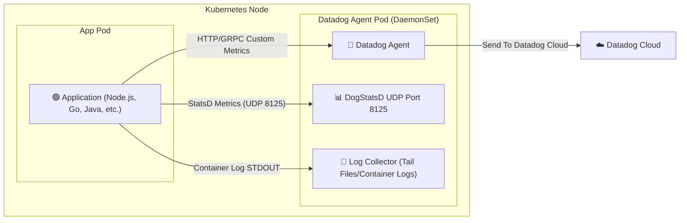

# Application Architecture



### Components

- **Application Pod**: รันแอปพลิเคชันของคุณ (เช่น Node.js, Go, Java)
- **Datadog Agent Pod**: รัน Datadog Agent ในรูปแบบ DaemonSet เพื่อเก็บ Metrics และ Logs จาก Application Pod
    - **DogStatsD**: รับ Metrics ผ่าน UDP port 8125
    - **Log Collector**: รวบรวม Logs จาก STDOUT ของ Container
- **Datadog Cloud**: บริการคลาวด์ของ Datadog ที่เก็บและแสดงผล Metrics และ Logs

### Data Flow

1. แอปพลิเคชันส่ง Metrics ไปยัง Datadog Agent ผ่าน DogStatsD
2. Datadog Agent รวบรวม Metrics และ Logs แล้วส่งไปยัง Datadog Cloud เพื่อการวิเคราะห์และแสดงผล
3. คุณสามารถดู Metrics และ Logs ผ่าน Datadog Dashboard ได้ทันที

### Benefits

- **Centralized Monitoring**: รวบรวม Metrics และ Logs จากหลายแอปพลิเคชันในที่เดียว
- **Scalability**: Datadog Agent รันในรูปแบบ DaemonSet ทำให้สามารถขยายตัวได้ตามจำนวน Node ในคลัสเตอร์
- **Flexibility**: รองรับหลายภาษาและแพลตฟอร์มของแอปพลิเคชัน
- **Real-time Insights**: ดูข้อมูลแบบเรียลไทม์เพื่อการวิเคราะห์ประสิทธิภาพและการแก้ไขปัญหา

## Test concepts on docker desktop kubernetes cluster with local image registry

Helm chart for deploying Datadog Agent alongside your application for monitoring and logging.

### Prerequisites

- Docker Desktop with Kubernetes enabled
- kubectl configured
- helm 3.x installed

### Quick Start

#### 1. Build & Deploy

**Build Image**

```bash
# จาก root ของ project
docker build -t test-devops:latest .
```

**Without Datadog (Local Testing):**

```bash
# จาก root ของ project
helm install test-devops ./helm/test-devops \
  --namespace test-devops \
  --create-namespace \
  --wait
```

**With Datadog:**

```bash
# Build Docker image
# Deploy with Helm + Datadog
helm upgrade --install test-devops ./helm/test-devops \
  --namespace test-devops \
  --create-namespace \
  --set datadog.apiKey=<YOUR_DATADOG_API_KEY> \
  --wait
```