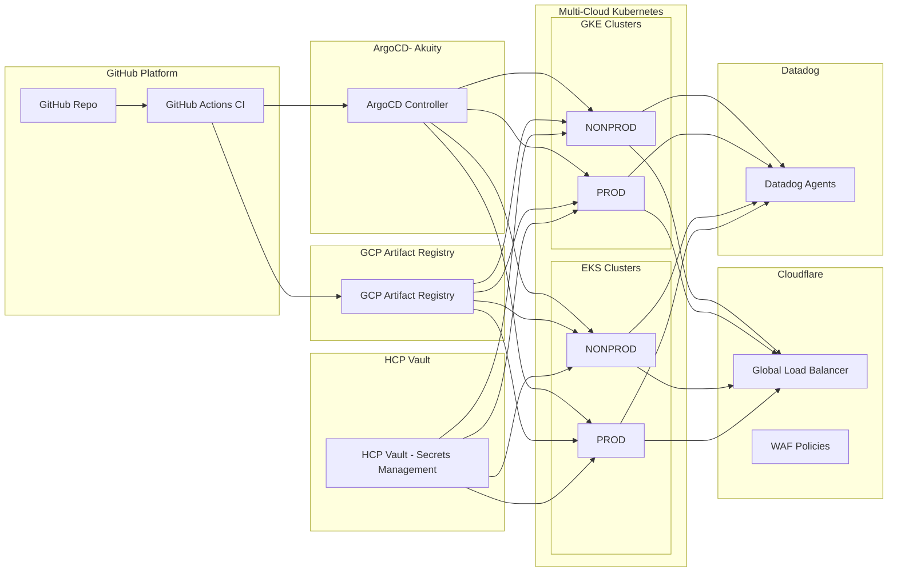

# Solution Architect

1. Github  Github action (CI)
- Source code management
- CI pipeline build, test, lint, security scan (SAST), build container image

2. ArgoCD (Akuity) — GitOps CD 
- Watch Git repo → auto-sync manifests
- Deploy to GKE/EKS multi-cloud
- Manage progressive rollout (Blue/Green, Canary)

3. Artifact Registry (GCP)
- Centralized Docker Image Storage
- Multi-cloud consumption (GKE + EKS)

4. HashiCorp Vault (HCP Vault — SaaS)
- JWT/OIDC auth (GitHub Actions, Kubernetes Service Account)
- Secrets management (DB credentials, API keys)
- Dynamic secrets (optional)

5. GKE + EKS (NON PROD + PROD)
- Workload clusters multi-cloud
- Each cluster installs:
- ArgoCD agent
- Vault Agent Injector (Sidecar)
- Datadog Agent (Daemon set)

6. Cloudflare Global Load Balancer + WAF
- Anycast Load Balancer (Global)
- Route to GKE/EKS multi-cloud cluster
- Zero Trust (WAF, Bot Protection, Firewall Rules)

7. Datadog Agents
- Logging (stdout)
- Metrics (autodiscovery)
- APM/Tracing
- RUM optional

Architecture Diagram:

