# Data Architect
This architecture shows how the system collects and sends metrics, logs, traces, and system resource data from the application and database to Datadog for monitoring and analysis.

1. User Layer
- End users send requests to the application, generating traffic that produces logs, metrics, and traces.

2. Workload Layer
- Application (Node.js) handles user requests.
- Database processes queries and generates query-related telemetry.

3. Telemetry Export Layer
- Metrics exported via StatsD.
- Traces collected using OpenTelemetry.
- Logs forwarded through STDOUT.
- Database telemetry includes slow-query logs and database traces.

4. System Resource Collection
- Collects container and node-level resource usage (CPU, memory, disk, IO).
- Database resource usage is also monitored separately.

5. Datadog Agent Layer
- Datadog Agent receives metrics, logs, traces, and system metrics.
- Performs processing and securely forwards data to Datadog.

6. Datadog Platform
- Provides dashboards, log analysis, APM tracing, system monitoring, and alerting.
- Enables performance insights, troubleshooting, and SLO-based alerting.

```mermaid
flowchart LR

%% ========= USER ==========
subgraph L0[🟨 User Layer]
    U1[End User / Client]
end

%% ========= WORKLOAD ==========
subgraph L1["WORKLOAD"]
    A1[Node.js Application]
    DB1[(Database
PostgreSQL/MySQL/MongoDB)]

    %% ========= TELEMETRY ==========
    subgraph L2[🟩 Telemetry Export Layer]
        E1["📊 Metrics Export (StatsD)"]
        E2["🧠 Trace Export (OpenTelemetry)"]
        E3["📄 Log Forward (STDOUT)"]
        E4["🗃 DB Slow Query Log & Trace"]
    end

    %% ========= SYSTEM ==========
    subgraph L3[🟫 System Resource Collector Layer]
        S1[📌 Container CPU/Memory Collector]
        S2[📌 Node Metrics / cAdvisor / Kubelet]
        S3[📌 DB Resource Usage Collector]
    end
end



%% ========= COLLECTION ==========
subgraph L4[🟧 Datadog Agent Collection Layer]
    D1["🐶 DogStatsD Metrics"]
    D2["💠 APM Trace Collector"]
    D3["📄 Log Processor"]
    D4["🔐 Secure Aggregator (HTTPS + API Key)"]
end

%% ========= ANALYTICS ==========
subgraph L5[🟥 Datadog Analytics & Alert Layer]
    DD1[📊 Metrics Dashboard]
    DD2[📌 Log Explorer]
    DD3["🧠 Trace Explorer (App + DB)"]
    DD4[🧮 System & DB Performance]
    DD5[🔔 Alert & SLO Monitoring]
end

%% ==== FLOWS =====
U1 -->|Request| A1
A1 -->|Queries| DB1

A1 -->|Runtime Metrics| E1 --> D1
A1 -->|Trace Spans| E2 --> D2
A1 -->|Logs| E3 --> D3

DB1 -->|Slow Query Logs| E4 --> D3
DB1 -->|DB Query Tracing| E4 --> D2

S1 --> D1
S2 --> D1
S3 --> D1

D1 --> D4 --> DD1
D2 --> D4 --> DD3
D3 --> D4 --> DD2
D1 --> D4 --> DD4
DD1 --> DD5
DD2 --> DD5
DD3 --> DD5
DD4 --> DD5
```

 
