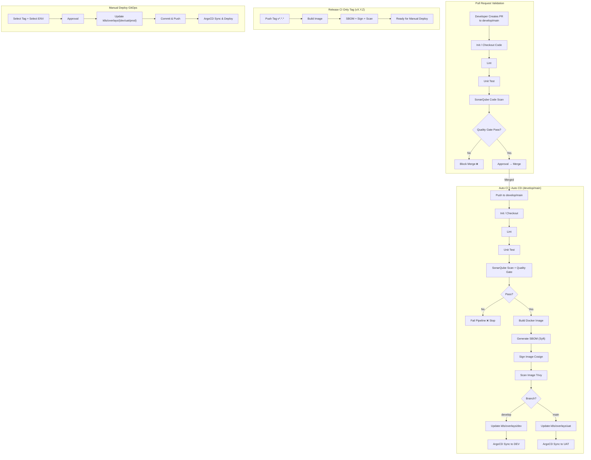
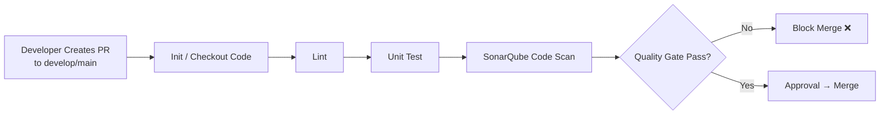
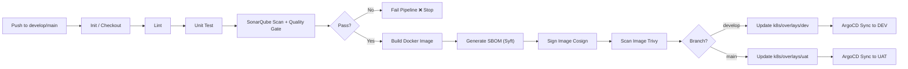
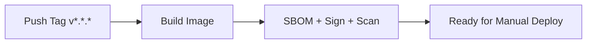
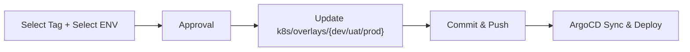

# Deployment Pipeline

Deployment pipelines automate the process of deploying applications to various environments, ensuring consistency,
reliability, and efficiency. This document outlines the key components and best practices for setting up a deployment
pipeline.

## Key Components

1. **Source Control Management (SCM)**: Use a version control system like GitHub to manage application code and
   configuration files.
2. **Continuous Integration (CI)**: Implement CI pipelines using GitHub Actions to automate code building, testing, and
   packaging.
3. **Continuous Deployment (CD)**: Use ArgoCD for GitOps-based deployments, enabling automated synchronization of
   application manifests to Kubernetes clusters.
4. **Container Registry**: Utilize GCP Artifact Registry to store and manage Docker images for multi-cloud deployments.
5. **Secrets Management**: Integrate HCP Vault for secure storage and management of application secrets and credentials.
6. **Kubernetes Clusters**: Deploy applications to GKE and EKS clusters for NON-PROD and PROD environments.
7. **Load Balancing and Security**: Use Cloudflare for global load balancing and web application firewall (WAF)
   protection.
8. **Monitoring and Logging**: Implement Datadog agents for comprehensive monitoring, logging, and tracing of
   application performance.

## Best Practices Continuous Integration

1. Push code changes to feature branches and create pull requests for review.
2. Automate testing and code quality checks in CI pipelines.
3. Use branch protection rules to enforce code reviews and approvals.
4. Tag releases and create release branches for production deployments.

## Best Practices Continuous Deployment

1. Use GitOps principles to manage application deployments through version-controlled manifests.
2. Implement progressive rollout strategies (Blue/Green, Canary) for safer deployments.
3. Monitor deployment status and set up alerts for failures or issues.
4. Regularly update and maintain deployment manifests and configurations.

## Security Considerations
1. Use HCP Vault for managing sensitive information and avoid hardcoding secrets in code or manifests.
2. Implement role-based access control (RBAC) for Kubernetes clusters and CI/CD tools.
3. Regularly audit and review access permissions and security policies.
4. Ensure compliance with industry standards and regulations for data protection.

## Monitoring and Logging
1. Set up Datadog dashboards to visualize application performance metrics and logs.
2. Implement APM and tracing to identify performance bottlenecks and issues.
3. Configure alerts for critical events and anomalies in application behavior.
4. Regularly review and analyze logs to improve application reliability and user experience.

## Conclusion
A well-structured deployment pipeline is essential for modern application development and operations. By following the
outlined components and best practices, organizations can achieve efficient, reliable, and secure deployments across
multiple environments.

## Flowchart Pipeline Overview

### Flow 1: Pull Request Pipeline (CI Only)

1. Developer creates a pull request (PR) to the `develop` or `main` branch.
2. CI pipeline triggers:
   - Checkout code
   - Linting
   - Unit tests
   - SonarQube code scan 
   - Quality gate check
3. If quality gate fails, block merge. If it passes, approve and merge PR.
4. Upon merge, auto CI/CD pipeline triggers.

### Flow 2: Auto CI/CD (develop → DEV, main → UAT)

- Push to `develop` or `main` branch triggers auto CI/CD pipeline:
- Checkout code
- Linting
- Unit tests
- SonarQube scan + quality gate
- If quality gate fails, pipeline stops.
- If it passes:
  - Build Docker image
  - Generate SBOM (Syft)
  - Sign image (Cosign)
  - Scan image (Trivy)
  - Update k8s overlays based on branch
  - if `develop` → `k8s/overlays/dev`
  - if `main` → `k8s/overlays/uat`
  - Commit and push changes to respective overlay directory.
  - ArgoCD sync to respective environment (DEV for develop, UAT for main)

### Flow 3: Release CI Only Tag (vX.Y.Z)

1. Push a tag in the format `vX.Y.Z` triggers release CI pipeline:
2. Build Docker image 
3. Generate SBOM, sign, and scan image 
4. Image is ready for manual deployment.

### Flow 4: Manual Deploy GitOps

1. Select the desired tag and environment (dev, uat, prod) for deployment.
2. Obtain approval for deployment.
3. Update the corresponding k8s overlay with the selected tag.
4. Commit and push changes to the repository.
5. ArgoCD syncs and deploys the application to the selected environment.