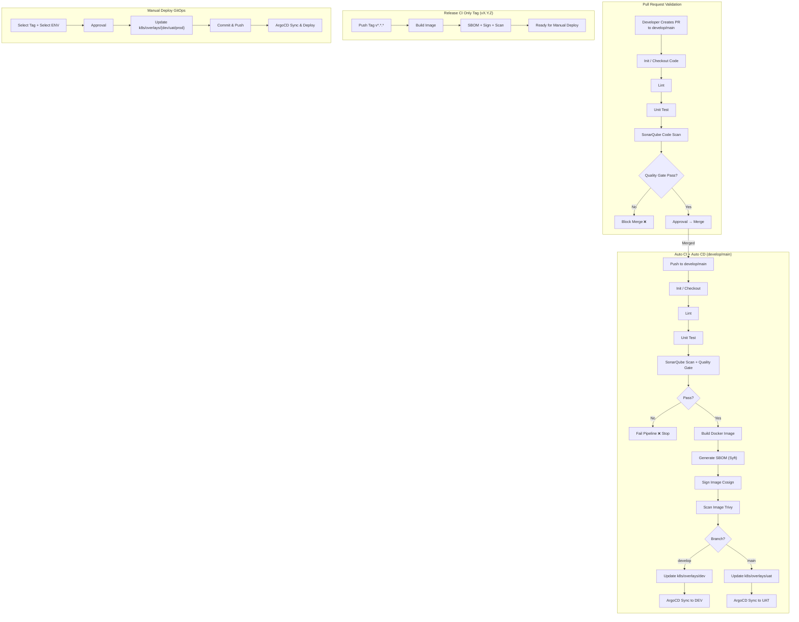
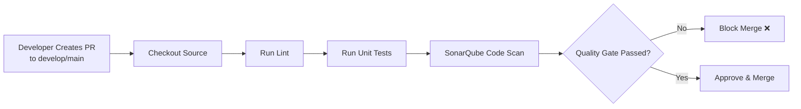
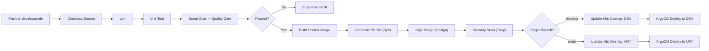
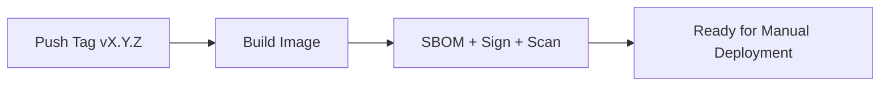
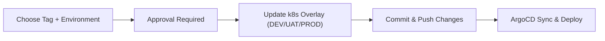

# Deployment Pipeline (Enterprise DevOps Standard)

A modern deployment pipeline ensures consistent, secure, and reliable delivery of applications across multiple
environments. This document describes the architecture, components, flows, and best practices for implementing an
enterprise-grade CI/CD pipeline.

## Core Components

| Component                  | Purpose                                          | Platform/Tool         |
|----------------------------|--------------------------------------------------|-----------------------|
| SCM                        | Source versioning, branch policies, PR workflows | GitHub                |
| CI                         | Build, test, code scan, image creation           | GitHub Actions        |
| CD (GitOps)                | Automated deployment via Kubernetes manifests    | ArgoCD (Codefresh)    |
| Container Registry         | Image storage, multi-cloud distribution          | GCP Artifact Registry |
| Secrets Management         | Centralized secure secrets & dynamic credentials | HCP Vault             |
| Runtime Platforms          | Multi-cloud Kubernetes workloads                 | GKE (GCP), EKS (AWS)  |
| Global Security & Routing  | WAF, DNS, global load balancing                  | Cloudflare            |
| Monitoring & Observability | Metrics, logging, APM tracing                    | Datadog               |

## CI Best Practices

1. Develop features in separate branches and submit Pull Requests.
2. Automate linting, unit tests, and code quality checks.
3. Gate merges using SonarQube Quality Gate results.
4. Enforce branch protection and mandatory reviewer approvals.
5. Use semantic tags (e.g., v1.2.0) for production-ready builds.

## CD Best Practices (GitOps)

1. Store Kubernetes manifests under version control.
2. Deploy changes only via Git (no kubectl/manual actions).
3. Use controlled rollout strategies:
    - Blue/Green
    - Canary
4. Maintain separate overlays for each environment (DEV/UAT/PROD).
5. Monitor deployment metrics and rollback automatically when required.

## Security Guidelines

1. Manage secrets exclusively through HCP Vault—never commit secrets.
2. Enforce RBAC on clusters, CI/CD pipelines, and artifact access.
3. Sign all images (Cosign) and generate SBOM (Syft).
4. Scan application and image vulnerabilities (SonarQube & Trivy).
5. Audit IAM roles regularly and enforce least-privilege access.

## Monitoring & Logging

1. Use Datadog dashboards to visualize metrics, logs, and infrastructure health.
2. Enable APM and distributed tracing for service observability.
3. Set alerts on key events:
    - Deployment health
    - Latency thresholds
    - Error rate anomalies
4. Review logs to continuously improve performance and user experience.

## Conclusion

A robust CI/CD pipeline is essential for modern enterprise delivery.
By following the practices outlined above, organizations can ensure ***secure***, ***reliable***,
and ***highly automated deployments*** across multi-cloud environments with full observability and governance.

## Pipeline Overview

### Overall Pipeline Diagram

### Flow 1: Pull Request Validation (CI Only)

Goal: Verify code quality before allowing merge to main branches.

How It Works:

| Step | Action                                                  | Purpose                                           |
|------|---------------------------------------------------------|---------------------------------------------------|
| 1    | Developer creates a Pull Request to `develop` or `main` | Prepare code for review and validation            |
| 2    | CI system checks out the source code                    | Load the code that needs validation               |
| 3    | Run `Lint`                                              | Ensure code formatting and standards              |
| 4    | Run `Unit Tests`                                        | Validate business logic and functionality         |
| 5    | Perform `SonarQube Code Scan`                           | Identify bugs, vulnerabilities, and code smells   |
| 6    | Evaluate `Quality Gate` result                          | Determine whether the code is acceptable          |
| 7    | If it fails → **Block Merge ❌**                         | Prevent bad code from entering main branches      |
| 8    | If it passes → **Approve & Merge ✔️**                   | Code is allowed into the repository’s main branch |

Outcome

- Only high-quality, tested, and secure code can be merged.
- Reduces production bugs and future rework.

### Flow 2: Auto CI/CD (develop → DEV, main → UAT)

Goal: Automatically Test + Build + Sign + Scan + Deploy for Non-Production Environments.

How It Works

| Step | Action                                   | Purpose                                              |
|------|------------------------------------------|------------------------------------------------------|
| 1    | Push commits to `develop` or `main`      | Trigger automated CI/CD                              |
| 2    | Run Lint, Unit Tests, and SonarQube scan | Double validation before deployment                  |
| 3    | If scan fails → ***Stop pipeline ❌***    | Prevent deployment of insecure code                  |
| 4    | If passed → Build Docker Image           | Prepare deployable application artifact              |
| 5    | Generate SBOM (via Syft)                 | Document software components for security compliance |
| 6    | Sign Image using Cosign                  | Ensure image authenticity                            |
| 7    | Scan Image using Trivy                   | Detect vulnerabilities in the container              |
| 8    | Update correct Kubernetes overlay        | Update image tag based on branch                     |
| 9    | ArgoCD detects change and Syncs          | Deploy automatically to respective cluster           |

Branch Deployment Mapping

| Branch    | Environment | Kubernetes Overlay |
|-----------|-------------|--------------------|
| `develop` | DEV         | `k8s/overlays/dev` |
| `main`    | UAT         | `k8s/overlays/uat` |

Outcome

- Every valid commit is automatically deployed to the intended environment.
- No manual kubectl usage → secure and traceable deployment.

### Flow 3: Release Tag — CI Only

How It Works

| Step | Action                                          | Purpose                                |
|------|-------------------------------------------------|----------------------------------------|
| 1    | Developer creates a version tag, e.g., `v1.0.0` | Marks release for production           |
| 2    | CI pipeline builds Docker Image                 | Create version-specific artifact       |
| 3    | Generate SBOM + Sign + Scan                     | Ensure full security compliance        |
| 4    | Publish the artifact                            | Image becomes available for deployment |
| 5    | No deployment occurs                            | Await manual approval and release      |

Outcome

- You get an official, secure, versioned production build.
- Deployment is controlled for risk-sensitive environments.

### Flow 4: Manual Deployment (GitOps)

Goal: Deploy selected versions using Git workflows with approval controls.

How It Works

| Step | Action                                      | Purpose                                   |
|------|---------------------------------------------|-------------------------------------------|
| 1    | Select image tag and target environment     | Decide what to deploy and where           |
| 2    | Deployment must be approved                 | Enforces controlled, auditable deployment |
| 3    | Update Kubernetes overlay with selected tag | Link the chosen release version           |
| 4    | Commit & Push the change                    | Version-controlled deployment             |
| 5    | ArgoCD detects manifest change and Syncs    | Deploys changes to the cluster            |
| 6    | Monitor deployment via ArgoCD + Datadog     | Track performance and health              |

Outcome

- Fully auditable deployment history via Git.
- Zero cluster access — no direct deployment by engineers.
- Production rollouts are secure, controlled, and traceable.

### Summary Comparison

| Flow              | Trigger               | Purpose                          | Deployment           |
|-------------------|-----------------------|----------------------------------|----------------------|
| **PR Validation** | Pull Request          | Verify quality                   | ❌ No                 |
| **Auto CI/CD**    | Push to develop/main  | Auto build + deploy non-prod     | ✔️ Automatic         |
| **Release Tag**   | Push tag              | Create production build          | ❌ No                 |
| **Manual Deploy** | Approval + Git change | Controlled production deployment | ✔️ Manual via GitOps |
